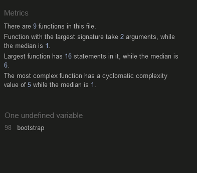

# Rock, Paper, Scissors, Lizard, Spock

**Rock, Paper, Scissors, Lizard, Spock** aims to provide a digital version of an intergenerationally popular game. While the primary audience is young children aged between 4 and 7 (KS1), it must also appeal to their parents as they would be the primary purchasers of such a game.

## Table of Contents

- [Features](#features)
- [Features left to implement](#features-left-to-implement)
- [Future features](#Future)
- [Testing](#testing)
- [Deployment](#deployment)
- [Credits](#credits)

## Features

This website was made by a composition of different features. For the overall design of the game, vibrant colours were chosen with the purpose of creating a vivid, vibrant and captivating website.

- **Header**

  - The header is shown on both pages, the home page and rules page. The header is fully responsive. It includes the full name of the game, together with icons for larger screens, and it only displays the icons of the game for smaller screens thus saving screen space for the user.
  - The header's purpose is to give a friendly and welcoming look to the user. By choosing bright and colourful colours, it is possible to make it more attractive to children.

    

- **Player's Name Section**

  - The player's name section allows the user to enter and display their name on the screen when playing the game. Thus feeling more idenfitied and relating in a closer manner to the game.
    

- **Landing Page Game**

  - It includes the game which is compound by:

    - The score of the player vs. the computer score.
    - Five buttons with the respective icon of the desired move by the player.
    - When a choice is made, the game will display the user's move and the computer moves, finally showing who's the winner of the round.
    - The winner is declared in a best of 5 games.
    - The game will finally display two different message on screen followed by a sound depending on whether the user wins or loses.
    - Finally, it also includes a rules page to comprehend the game and reset button to restart the game.

    

- **Footer**

  - The footer includes links to the GitHub pages of each collaborator. It will open on a new tab to allow easy navigation for the user.
  - It is a valuable feature, since it will allow future employers to have an easy access to other projects made by the team members.

    

- **Rules**

  - The rules page provides a brief and simple explanation of the rules of the game.
  - It also includes three different buttons:

    - The Teacher Probability Plan:
    - Home page button that will allow the user to return to the main page after reading the rules of the game.
    - National Curriculum KS3 Reference

    

## Features Left to Implement

- Two-players Mode
- Timer
- Quiz

## Future Features

When we started this project we assumed that game would best suit very young children in the 4-7 year old category. However as we progressed with our research we realised that it is the 11-14 year old age range that study Probability as part of the National Curriculums in England and Wales. We only had time to include produce one suitable lesson plan on this topic as content to supplement the game itself. However we realised that there is a whole Scheme of Work that could be developed from this game utilising multiple lesson plans. Therefore for future iterations of this product we would like to introduce some live video or animated explanatons of how to calculated the game probabilities together with several interactive quizzes, and of course the lesson plans to enable teachers, parents, and students to be able to use the product to obtain most educational benefits. 

## Testing

We completed alot of the responsiveness and function testing as we went along. After a new feature was added to our project we would then run the site through dev tools checking different device sizes to ensure responsiveness and features were working as expected. We had a slight stuggle with the header, ensuring the words pushed down into imgs when on smaller devices. However after spending some time referring to the bootstrap wesbite we were able to accomplish what we set out.

- **Validator Testing**

- HTML

  !- insert index html w3c-!
  !- insert rules html w3c-!

- CSS
    

- Javascript
    

- **Responsiveness Testing**

| **Page** | **ACTION**                                      | **EXPECTATION**                       | **RESULT**        |
| -------- | ----------------------------------------------- | ------------------------------------- | ----------------- |
| Index    | Size to 320px by 800px using Chrome Dev Tools   | Elements look good @ 320px by 800px   | Works as expected |
| Index    | Size to 798px by 1024px using Chrome Dev Tools  | Elements look good @ 1920px by 1080px | Works as expected |
| Index    | Size to 1920px by 1080px using Chrome Dev Tools | Elements look good @ 1920px by 1080px | Works as expected |
| Rules    | Size to 320px by 800px using Chrome Dev Tools   | Elements look good @ 320px by 800px   | Works as expected |
| Rules    | Size to 798px by 1024px using Chrome Dev Tools  | Elements look good @ 1920px by 1080px | Works as expected |
| Rules    | Size to 1920px by 1080px using Chrome Dev Tools | Elements look good @ 1920px by 1080px | Works as expected |

- **Browser Testing**

For browser testing we used https://www.browserling.com as well as our own devices. As we used emojis to keep to the child audience it come apprent some emojis were not cross browser compatable, our rock emoji would not work on Safari so we had to change it to a fist.

- Chrome Version 90.0.4430.212 (Official Build) (64-bit) - Works as expected.
- Firefox Version 88.0.1 (64-bit) - Works as expected.
- Safari on macOS Catalina (Safari Version 14.0.3) - Works as expected (rules buttons highlights as hyperlink)
  

- **Lighthouse**
  You will see our lighthouse reports are not perfect, main suggestions were the img increasing page loading time. However we as a team feels the pages load is sufficent time.

**User Experience Testing**
We asked two Maths teachers to test our project and obtained verbal feedback. They both responded that they liked the site and felt that it could be useful used in the right home or class context. They were content that the lesson plan was suitable for our target age range, and said that the game was visually appealing. Homework Quizz games based on calculating probabilties was suggested as a future feature. 
We also asked a group of parents and children of the target age range for their opinion. All said the game was easy to understand, fun to play, and that it worked on a variety of screen sizes.  

- **Unfixed Bugs**
  Input field accepts special characters and numbers. We tried to resolve VIA pattern attribute in HTML however this would not work as the input field was not posting or getting. However we use .value in javascript to pull it out the input field and apply it with userscore. The work around is a javascript regex that pulls out the numbers and special characters before applying to user score after researching and help of chatGPT.

## Deployment

- The site was deployed to GitHub pages. The steps to deploy are as follows:
  - In the GitHub repository, navigate to the Settings tab
  - From the source section drop-down menu, select the Master Branch
  - Once the master branch has been selected, the page will be automatically refreshed with a detailed ribbon display to indicate the successful deployment.

The live link can be found here - https:/[/caleom.github.io/Hackathon2/]

## Credits

- User Experience Testers were members of "ALN Cymru - HE & EOTAS", a parent peer support network for those educated outside school in Wales. This was simply because these were the people we had time to ask to view and test the finished product within the time constraints of this project. 

### Content

- The header's font style was taken from [Font Space](https://www.fontspace.com/whale-i-tried-font-f30502).
- The game's section's font style was taken from [Google Fonts](https://fonts.google.com/).
- The icons in the game's section were taken from [GetEmoji](https://getemoji.com/).
- The icons in the footer were taken from [Font Awesome](https://fontawesome.com/).
- The icons in the header were taken from [RPSLS](https://rpsls.net/#vis1d).
- The Teacher Probability Plan was self-created.
- The National Curriculum KS3 Preference was taken from [NCTEM](https://www.ncetm.org.uk/in-the-classroom/national-curriculum-resource-tool/?topic=1388)
- [ChatGPT](https://chat.openai.com/) was also used as a support for the generation and research of resources.
- Lesson plan reference 1 [https://math.stackexchange.com/questions/376187/probability-game]
- Lesson plan reference 2 [https://medium.com/@neelymann/how-to-java-lizard-spock-f1069952012b]
- Lesson plan reference 3 [https://www.naturphilosophie.co.uk/winning-rock-paper-scissors-lizard-spock/]
- Lesson plan reference 4 [https://www.reddit.com/r/theydidthemath/comments/vp21x6/request_rock_paper_scissors_lizard_spock/]

### Media

- The header's cloud image was taken from [Wallpaper Flare](https://www.wallpaperflare.com/clouds-figure-background-simpsons-art-beginning-cartoon-wallpaper-uzhuk).
- The image picture of the character Sheldon Cooper from The Big Bang Theory and Captain Spock from Star Treck was taken from [InfoSeriesTv](https://www.infoseriestv.com/wp-content/uploads/2012/03/The-Big-Bang-Theory.jpg)
- The sounds were taken from [MiXKIT](https://mixkit.co/free-sound-effects/).
